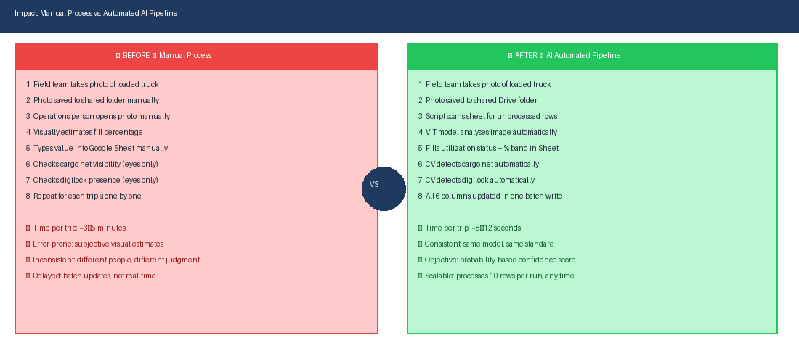

# 🚛 AI-Powered Truck Utilization Analyzer — Vision Transformer + OpenCV

> *An end-to-end automation pipeline that eliminates manual image review of truck loading photos — using a fine-tuned Vision Transformer (ViT) and OpenCV computer vision to automatically classify truck fill levels, detect cargo nets and digital locks, and write structured results directly into Google Sheets.*

---

## 📌 The Problem This Solves

Every trip in a line haul network generates a truck loading photo. Before this system, someone had to:

1. Open each photo manually
2. Visually estimate how full the truck was
3. Type the fill percentage into a Google Sheet
4. Visually check if a cargo net was present
5. Visually check if a digital lock was fitted
6. Repeat — for every single trip

This was time-consuming, subjective, inconsistent across reviewers, and impossible to scale.

**This project replaces that entire manual process with an automated AI pipeline that runs in Google Colab and completes the same task in 8–12 seconds per trip.**

---

## 🔄 System Pipeline


The pipeline has five stages:

| Stage | What Happens |
|---|---|
| **1. Image in Drive** | Field team uploads truck photo to Google Drive as usual — no process change for them |
| **2. Search & Download** | Script searches Drive by Trip ID, handles name variants and normalisation |
| **3. ViT Inference** | Fine-tuned Vision Transformer classifies fill level into one of 5 bands |
| **4. CV Feature Extraction** | OpenCV independently detects cargo net (line detection) and digital lock (contour detection) |
| **5. Sheet Auto-Update** | All 6 output columns written to Google Sheet in a single batch API call |

---

## 🎯 What the Model Detects

### Fill Level — 5 Classes


| Class | Fill Level | Operational Meaning |
|---|---|---|
| 0 | < 50% | Under-loaded — significant space wastage |
| 1 | ≥ 50% & < 70% | Below target — needs improvement |
| 2 | ≥ 70% & < 85% | Near target — acceptable |
| 3 | ≥ 85% & < 100% | Target met — good utilization |
| 4 | ≥ 100% | Fully loaded — optimal |

### Secondary Features (OpenCV — Always Active)

| Feature | Detection Method | Output |
|---|---|---|
| **Cargo Net** | Hough Line Transform — detects net grid pattern (>35 lines threshold) | Yes / No |
| **Digital Lock** | Contour detection — identifies rectangular device shape (400–5000px area, 0.4–2.5 aspect ratio) | Yes / No |

These two features run via classical computer vision (no neural network) — fast, lightweight, and independent of the ML model.

---

## 📊 Google Sheet Output


For every processed trip row, 6 columns are automatically populated:

| Column | Field | Example Output |
|---|---|---|
| Image Link | Direct Drive URL | `drive.google.com/...` |
| Utilization Status | Binary flag | `YES` / `NO` |
| Fill Level | Band label | `≥85% & <100%` |
| Confidence | Model certainty | `92.4%` or `79.2% (Validate Manually)` |
| Cargo Net | CV detection result | `Yes` / `No` |
| Digilock | CV detection result | `Yes` / `No` |

Confidence below 85% is explicitly flagged `(Validate Manually)` — the system is honest about uncertainty rather than writing a wrong answer with false confidence.

---

## ⚡ Before vs. After Automation



| Dimension | Manual Process | Automated Pipeline |
|---|---|---|
| Time per trip | 3–5 minutes | 8–12 seconds |
| Fill level assessment | Subjective visual estimate | Probability-based ML classification |
| Consistency | Varies by reviewer | Same model, same standard every time |
| Cargo net check | Human eyes, often missed | CV line detection, always checked |
| Digilock check | Human eyes, often missed | CV contour detection, always checked |
| Scale | One person, one image at a time | Batch processing, runs any time |
| Error handling | Silent — wrong data entered | Flags uncertain predictions for review |

---

## 🧠 Model Architecture


### Vision Transformer (ViT-B/16)

The model uses **transfer learning** on top of a pre-trained Vision Transformer:

- **Base model**: `ViT-B/16` pre-trained on ImageNet (Google Brain, 2020)
- **Custom head**: The default 1000-class classification head is replaced with a 5-class linear layer matching the 5 utilization bands
- **Input size**: 224×224 pixels (ViT requirement — strict patch grid)
- **Training**: 40 epochs, Adam optimizer, learning rate 1e-4, StepLR scheduler (halves every 15 epochs)
- **Batch size**: 8 (reduced from standard due to ViT VRAM requirements)
- **Loss function**: CrossEntropyLoss

### Why ViT over CNN?

Vision Transformers use self-attention across image patches rather than local convolutional filters. For truck loading images — where the relationship between different regions of the image (front vs. rear fill level, presence of objects at different positions) matters — ViT's global attention mechanism captures spatial relationships that CNNs may miss in localised receptive fields.

### Data Augmentation Strategy

```
RandomHorizontalFlip  →  handles mirror-orientation truck photos
RandomRotation(10°)   →  handles slightly angled shots
RandomPerspective     →  handles photos taken at different heights/angles
ColorJitter           →  handles lighting variation (day/night/warehouse)
ImageNet Normalize    →  standard ViT normalisation (mean/std)
```

### Class Imbalance Handling

Large asset images are augmented ×3 during training; Non-Large ×2. This ensures the model sees a balanced representation of both asset types despite unequal sample availability in the source data.

---

## 🔧 Technical Stack

| Component | Technology | Purpose |
|---|---|---|
| **ML Framework** | PyTorch + TorchVision | ViT model definition, training, inference |
| **Base Model** | ViT-B/16 (ImageNet weights) | Transfer learning backbone |
| **Computer Vision** | OpenCV (cv2) | Cargo net and digilock detection |
| **Image Processing** | Pillow (PIL) | Image loading, colour conversion |
| **Sheets Integration** | gspread | Google Sheets read/write |
| **Drive Integration** | Google Drive API v3 | Image search and download |
| **Runtime** | Google Colab (GPU) | CUDA-accelerated training and inference |
| **Auth** | Google OAuth2 | Colab-native authentication |

---

## 🔁 Run Modes

The script supports three operating modes controlled by `RUN_MODE`:

| Mode | What It Does |
|---|---|
| `TRAIN` | Downloads up to 100 labelled images per sheet, trains the ViT, saves weights to `.pth` file |
| `INFERENCE` | Loads saved weights, scans for blank rows in sheets, runs predictions, writes results |
| `AUTO` | Tries to load weights first; if no weights found, trains automatically before inferring |

---

## 📁 Repository Structure

```
truck-utilization-analyzer/
│
├── truck_utilization_analyzer.ipynb   # Main Google Colab notebook
├── truck_vit_model_weights.pth        # Saved ViT weights (generated after training)
│
├── screenshots/
│   ├── truck_pipeline_diagram.png
│   ├── truck_utilization_classes.png
│   ├── truck_before_after.png
│   ├── truck_sheet_output.png
│   └── truck_vit_architecture.png
│
└── README.md
```

> **Note:** `truck_vit_model_weights.pth` is not included in this repository (binary file, ~330MB). Run in `TRAIN` mode on your own labelled dataset to generate it.

---

## 🚀 Setup & Usage

### Prerequisites
- Google Colab account (free tier works; GPU runtime recommended for training)
- Google Sheet with trip data and image links
- Google Drive folder containing truck loading images named by Trip ID

### Steps

**1. Open in Colab**
Upload `truck_utilization_analyzer.ipynb` to Google Colab.

**2. Configure**
Update the configuration section:
```python
SHEET_URL = 'your_google_sheet_url'
SHEET_ID  = 'your_sheet_id'
RUN_MODE  = "INFERENCE"   # or "TRAIN" for first run
```

**3. Set column indices**
Update `SHEET_CONFIGS` with the correct column indices for your sheet structure (utilization, link, level, confidence, cargo net, digilock columns).

**4. Run**
Execute all cells. Colab handles authentication via `google.colab.auth`.

**5. First run**
Set `RUN_MODE = "TRAIN"` with labelled data in `TRAIN_LABEL_COL_INDEX` column. After training completes, switch to `INFERENCE` for ongoing use.

---

## 🛠️ Skills This Project Demonstrates

| Skill Area | Specifics |
|---|---|
| **Deep Learning** | Transfer learning with ViT-B/16; custom classification head; training loop with scheduler |
| **Computer Vision** | OpenCV Hough Line Transform for cargo net; contour detection for digilock identification |
| **ML Engineering** | Model serialisation/deserialisation; confidence thresholding; class imbalance handling via augmentation |
| **Google Workspace Automation** | Sheets API (batch write), Drive API v3 (file search + download), OAuth2 via Colab |
| **Process Automation** | Replaced a manual 3–5 min/trip human review process with an 8–12 sec automated pipeline |
| **Production Thinking** | Graceful error handling, skip logic for already-processed rows, "Validate Manually" flagging for low-confidence predictions, API quota management via batch writes |
| **Data Engineering** | Trip ID normalisation and fuzzy file matching across Drive; handles name variants and special characters |

---

## 🔒 Privacy Note

No actual truck images, trip IDs, or operational data are included in this repository. All screenshots showing sheet outputs use masked/dummy data. The model weights file is not included as it was trained on proprietary operational imagery.

---

## 👤 Author

Built to automate a manual, time-intensive operational review process in line haul logistics. Designed for ongoing use in production with a rotating dataset of new trip images each month.

---

*Built with PyTorch · ViT-B/16 · OpenCV · Google Colab · Google Sheets API · Google Drive API*
