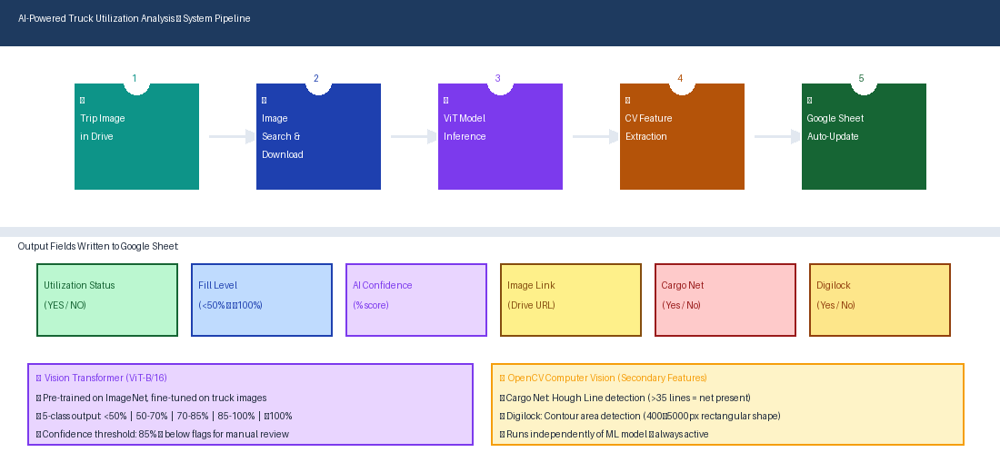
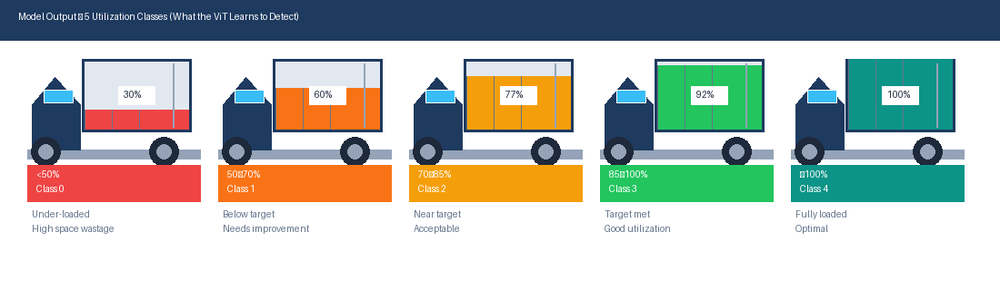
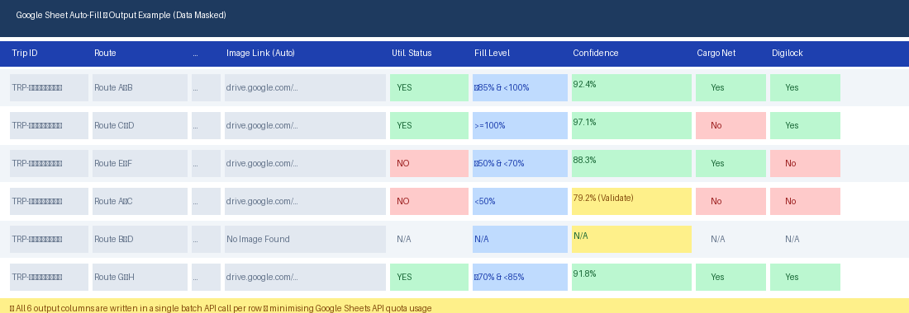
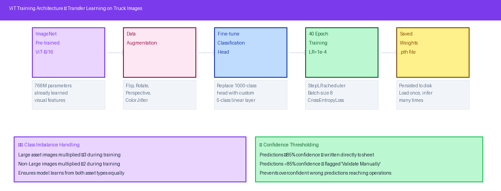

# 🚛 AI-Powered Truck Utilization Analyzer

## Use Case
Every trip generated a truck loading photo that had to be manually reviewed — estimating fill level, checking for cargo net, and checking for digital lock. This took 3–5 minutes per trip, was subjective, and couldn't scale across hundreds of daily trips.

## How It Helped
Fine-tuned a Vision Transformer (ViT-B/16) to classify truck fill level into 5 bands. OpenCV independently detects cargo net and digital lock. The pipeline fetches images from Google Drive by Trip ID and writes 6 structured columns to Google Sheets automatically in 8–12 seconds.

## My Role
Designed the full pipeline — model architecture, transfer learning approach, training data strategy, OpenCV feature extraction logic, and Google Sheets/Drive integration.

## Views

**System Pipeline** — End-to-end flow from Drive image → ViT inference → OpenCV detection → 6-column Sheets auto-update in a single batch write.

**5 Utilization Classes** — What the model learns to detect: fill levels from under-loaded (<50%) to fully loaded (≥100%), shown as cargo illustrations per class.

**Sheet Output** — The 6 columns auto-written per trip row: Image Link, Utilization Status, Fill Level, Confidence %, Cargo Net, Digilock — with colour-coded confidence flagging.

**ViT Architecture** — Transfer learning flow: ImageNet pre-trained ViT-B/16 → data augmentation → fine-tuned 5-class head → confidence thresholding at 85%.

## Output
6 columns auto-filled in Google Sheets per trip. Predictions below 85% confidence flagged `(Validate Manually)`. Replaces 3–5 min manual review with 8–12 seconds — consistent, objective, scalable.

---
*PyTorch · ViT-B/16 · OpenCV · Google Sheets API · Drive API · Google Colab*
